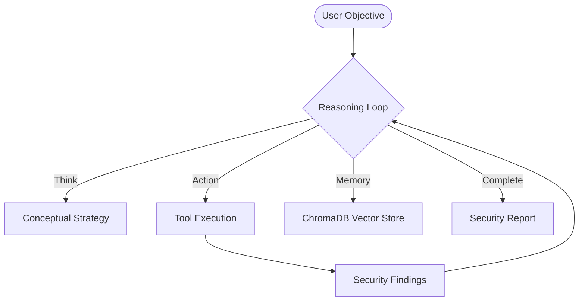

<p align="center">
  
</p>

# <h1 align="center">🛡️ SMAUG: Autonomous Security platform</h1>

<p align="center">
  <a href="https://opensource.org/licenses/MIT"></a>
  <a href="https://www.python.org/"></a>
  <a href="https://ollama.ai/"></a>
  <a href="https://github.com/malrobust/SMAUG/actions/workflows/ci.yml"></a>
  <a href="https://github.com/malrobust/SMAUG/stargazers"></a>
</p>

**Smaug** is a terminal-based autonomous security researcher. It uses Local LLMs to reason through security objectives and orchestrate specialized tools to identify and report vulnerabilities.

## 🏛️ Core Architecture

Smaug operates on a **Reasoning-Action-Observation** loop (ReAct), powered by the **Livion Engine**.



## ⚡ Integrated Capabilities

| Category | Capability | Tools |
| :--- | :--- | :--- |
| **Intelligence** | Subdomain & Tech Discovery | Amass, HTTPX, WhatWeb |
| **Scanning** | Port & Vulnerability Analysis | Nmap, Nuclei, FFUF |
| **Exploitation** | Managed Vulnerability Checks | SQLMap, Dalfox |
| **Memory** | Semantic Search Persistence | ChromaDB |
| **Execution** | System & Shell Control | Subprocess, File I/O |

## 🚀 Installation & Setup

### Prerequisites
- Python 3.10+
- [Ollama](https://ollama.ai/)

### Setup
```bash
git clone https://github.com/malrobust/SMAUG.git
cd SMAUG
pip install -r requirements.txt
python3 smaug_setup.py
```

### Usage
```bash
python3 main.py
```
**Example Objective**: `smaug > audit testphp.vulnweb.com for SQL vulnerabilities and generate a report`

## 🛠️ Operational Scope
Security boundaries are enforced in `config.yaml`:
```yaml
security:
  scope:
    - "testphp.vulnweb.com"
  blocked_commands:
    - "rm -rf /"
```

## 📜 License
Distributed under the MIT License. See `LICENSE` for more information.

---
**Disclaimer**: Smaug is for authorized security research only. Unauthorized testing is illegal.
