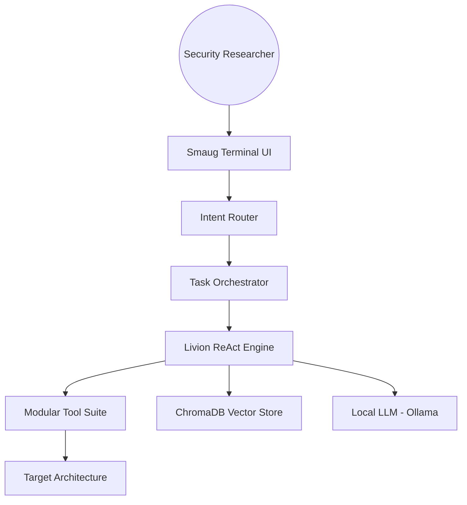

# SMAUG | The Autonomous Security Operations Platform 🚀

[](https://opensource.org/licenses/MIT)
[](https://github.com/malrobust/LIVION)
[](https://github.com/malrobust/LIVION)

**SMAUG** is an enterprise-grade autonomous security orchestration platform designed to automate the lifecycle of vulnerability research, penetration testing, and system auditing. Built on the **Livion Autonomous Engine**, Smaug leverages private local LLMs to deliver high-fidelity security insights while ensuring absolute data sovereignty.

---

## 🔥 Enterprise Features

### 🧠 Livion ReAct Core
A state-of-the-art Reasoning-Action engine that autonomously plans, executes, and validates security tasks with near-human cognition.

### 🛡️ Data Sovereignty by Design
Execute complex security workflows entirely on-premise. No APIs, no data leaks, no third-party dependencies for intelligence.

### ⚡ Parallel Security Orchestration
Scale your security operations with multi-threaded task decomposition. Smaug breaks down high-level objectives into surgical executions.

### 🎙️ Multi-Modal Interface
Interact via a premium CLI or go hands-free with real-time neural speech synthesis and recognition.

### 🧩 Extensible Tool Architecture
Easily integrate custom exploit modules, network scanners, and reporting engines into the unified Smaug framework.

---

## 🛠️ Deployment

### System Requirements
- **OS**: Linux (Kali Recommended), macOS, or WSL2
- **CPU**: 8+ Cores recommended for local LLM inference
- **RAM**: 16GB+ (8GB minimum)
- **Engine**: [Ollama](https://ollama.ai/) (Running Version 0.1.30+)

### Installation

```bash
# Clone the Enterprise Repository
git clone https://github.com/malrobust/LIVION.git
cd LIVION

# Install Modular Dependencies
pip install -r requirements.txt

# Initial Configuration
cp config.yaml.example config.yaml
```

### Quick Launch
```bash
python3 main.py
```

---

## 📊 Solution Architecture



---

## 🔒 Security & Compliance

Smaug is designed for professional security audits. By using this platform, you agree to the **Malrobust Security Ethics Agreement**. 

- **Internal Safety Scope**: Hardcoded operational boundaries in `config.yaml`.
- **Command Sanitization**: Real-time filtering of destructive system commands.
- **Privacy**: Zero external telemetry.

For vulnerability disclosure regarding Smaug itself, please see [SECURITY.md](SECURITY.md).

---

## 🏢 About Malrobust

Smaug is a flagship product of **Malrobust**, dedicated to advancing autonomous security technologies. Learn more at [github.com/malrobust](https://github.com/malrobust).

---

## 📄 License

Professional distribution under the [MIT License](LICENSE). 
© 2026 Malrobust.
