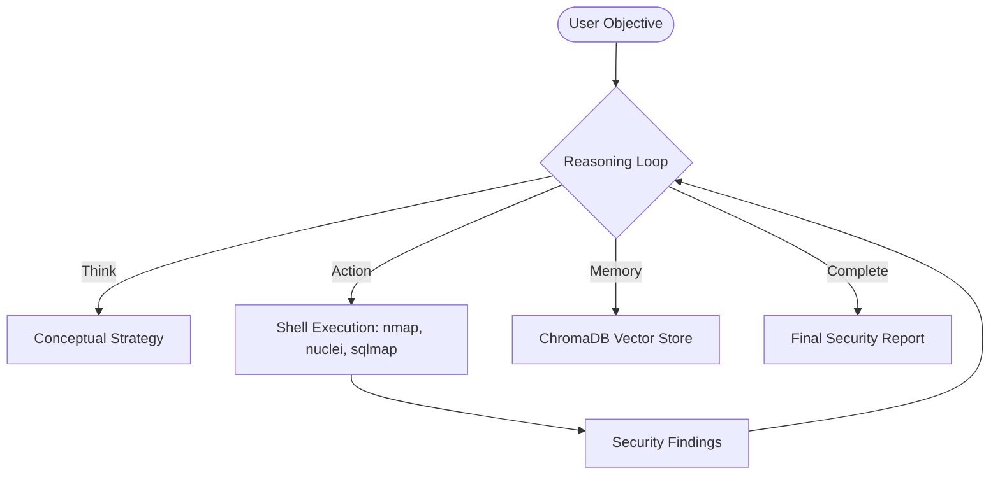

<p align="center">
  
</p>

# 🛡️ SMAUG: Autonomous Cyber Security Agent

[](https://opensource.org/licenses/MIT)
[](https://www.python.org/)
[](https://ollama.ai/)
[](https://github.com/malrobust/LIVION/actions/workflows/ci.yml)
[](https://github.com/malrobust/LIVION/stargazers)

**Smaug** is a high-fidelity, autonomous terminal agent designed for intelligent security reconnaissance and vulnerability research. By bridging the gap between Large Language Models and offensive security tooling, Smaug reasons through complex security objectives, chains multi-stage discovery tools, and delivers real-time intelligence directly to your command center.

---

## 🏛️ Core Architecture

Smaug operates on a dynamic **Reasoning-Action-Observation** loop, powered by the **Livion Autonomous Engine** and Local LLMs.



## ⚡ Key Capabilities

| Feature | Description | Technical Stack |
| :--- | :--- | :--- |
| **Autonomous Reasoning** | Self-correcting logic loops that adapt to tool outputs. | Livion Engine (ReAct) |
| **Local Intelligence** | Real-time security research and fingerprinting without external APIs. | Ollama / Mistral |
| **Tool Orchestration** | Native execution of standard security suites (Recon, Scanning, Exploit). | Python / Subprocess |
| **Persistent Memory** | Cross-session intelligence storage for multi-stage attacks. | ChromaDB |

## 🚀 Getting Started

### Prerequisites
- Python 3.10 or higher
- [Ollama](https://ollama.ai/) (Running Version 0.1.30+)
- [Optional] `pyaudio` for Voice Mode

### Installation
```bash
# Clone the repository
git clone https://github.com/malrobust/LIVION.git

# Navigate to project directory
cd LIVION

# Install dependencies
pip install -r requirements.txt

# Configure your environment
cp config.yaml.example config.yaml
```

### Usage
Launch the agent with a high-level security objective:
```bash
python3 main.py
```
Or use the prompt once inside:
`smaug > perform a stealthy recon on dev-staging.local and report any exposed SQL services`

## 🛠️ Configuration
Edit `config.yaml` to define your operational boundaries:
```yaml
security:
  scope:
    - "localhost"
    - "testphp.vulnweb.com"
  blocked_commands:
    - "rm -rf /"
```

## 🗺️ Roadmap
- [ ] **Dockerized Environments**: Isolated execution for security tools.
- [ ] **Multi-Model Support**: Support for GPT-4o and Claude 3.5 Sonnet.
- [ ] **Custom Plugin System**: Enable users to write their own tool-chaining logic.
- [ ] **Web Dashboard**: A real-time visual interface for agent logs and findings.

## 🤝 Contributing
Contributions are what make the open-source community such an amazing place to learn, inspire, and create. Any contributions you make are **greatly appreciated**.

1. Fork the Project
2. Create your Feature Branch (`git checkout -b feature/AmazingFeature`)
3. Commit your Changes (`git commit -m 'Add some AmazingFeature'`)
4. Push to the Branch (`git push origin feature/AmazingFeature`)
5. Open a Pull Request

## 📜 License
Distributed under the MIT License. See `LICENSE` for more information.

---
**Disclaimer**: Smaug is for educational and ethical security research purposes only. Unauthorized access to computer systems is illegal. Always obtain explicit permission before testing.
