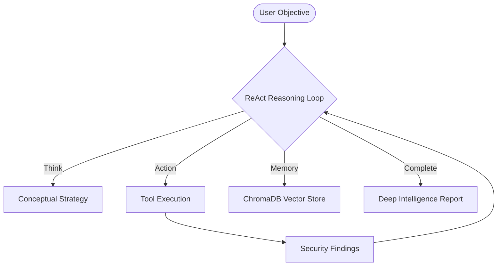

<p align="center">
  
</p>

# <h1 align="center">🛡️ SMAUG: Autonomous Cyber Security Agent</h1>

<p align="center">
  <a href="https://opensource.org/licenses/MIT"></a>
  <a href="https://www.python.org/"></a>
  <a href="https://ollama.ai/"></a>
  <a href="https://github.com/malrobust/SMAUG/actions/workflows/ci.yml"></a>
  <a href="https://github.com/malrobust/SMAUG/stargazers"></a>
</p>

**Smaug** is a high-fidelity, autonomous terminal agent designed for intelligent security reconnaissance and vulnerability research. By bridging the gap between Large Language Models and offensive security tooling, Smaug reasons through complex security objectives, chains multi-stage discovery tools, and delivers real-time intelligence directly to your command center.

---

## 🏛️ Core Architecture

Smaug operates on a dynamic **Reasoning-Action-Observation** loop, powered by the **Livion Autonomous Engine** and Local LLMs.



## ⚡ Key Capabilities

| Category | Capability | Integrated Tools |
| :--- | :--- | :--- |
| **Reconnaissance** | High-fidelity subdomain & tech discovery. | Amass, HTTPX, WhatWeb |
| **Vulnerability Research** | Automated surface-area scanning. | Nuclei, Nmap, FFUF |
| **Exploitation** | Managed vulnerability verification. | SQLMap, Dalfox |
| **Memory Engine** | Persistent cross-session intelligence. | ChromaDB |
| **Interaction** | Multi-modal terminal interface. | Voice (TTS/STT), Rich UI |

## 🚀 Getting Started

### Prerequisites
- Python 3.10 or higher
- [Ollama](https://ollama.ai/) (Running Version 0.1.30+)
- [Optional] `pyaudio` for Voice Mode

### Installation
```bash
# Clone the repository
git clone https://github.com/malrobust/SMAUG.git

# Navigate to project directory
cd SMAUG

# Install dependencies
pip install -r requirements.txt

# Configure your environment (Automatic)
python3 smaug_setup.py
```

### Usage
Launch the agent with a high-level security objective:
```bash
python3 main.py
```
Or use the prompt once inside:
`smaug > perform a stealthy recon on dev-staging.local and report any exposed SQL services`

## 🛠️ Configuration
Edit `config.yaml` to define your operational boundaries:
```yaml
security:
  scope:
    - "localhost"
    - "testphp.vulnweb.com"
  blocked_commands:
    - "rm -rf /"
```

## 🗺️ Roadmap
- [ ] **Dockerized Tooling**: Isolated execution environments for external security binaries.
- [ ] **Multi-Agent Swarms**: Collaborative reasoning between specialized security agents.
- [ ] **Custom Plugin SDK**: Simplified interface for adding proprietary exploit modules.
- [ ] **Graph Visualization**: Real-time interactive visualization of attack surface mappings.

## 🤝 Contributing
Contributions are what make the open-source community such an amazing place to learn, inspire, and create. Any contributions you make are **greatly appreciated**.

1. Fork the Project
2. Create your Feature Branch (`git checkout -b feature/AmazingFeature`)
3. Commit your Changes (`git commit -m 'Add some AmazingFeature'`)
4. Push to the Branch (`git push origin feature/AmazingFeature`)
5. Open a Pull Request

## 📜 License
Distributed under the MIT License. See `LICENSE` for more information.

---
**Disclaimer**: Smaug is for educational and ethical security research purposes only. Unauthorized access to computer systems is illegal. Always obtain explicit permission before testing.
